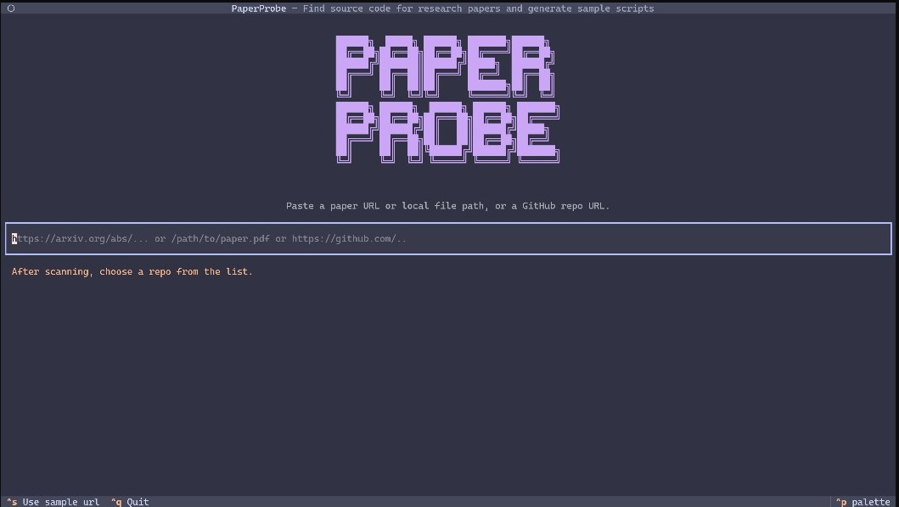

<div align="center">

# PaperProbe

**Automatically analyze and generate usage examples for scientific code from research papers**

[](https://www.python.org/downloads/)
[](LICENSE.txt)
[](https://github.com/astral-sh/ruff)

[Features](#-features) • [Installation](#-installation) • [Usage](#-usage) • [Configuration](#-configuration) • [Contributing](#-contributing)

</div>

<div align="center">
  
  <p><em>Beautiful terminal user interface for analyzing scientific repositories</em></p>
</div>

## What is PaperProbe?

PaperProbe bridges the gap between scientific papers and their associated code repositories. It automatically:

- 📄 **Scans research papers** (arXiv URLs or local PDFs) for GitHub repository links
- 🔍 **Analyzes repositories** to understand structure, dependencies, and usage patterns
- 🤖 **Generates usage examples** using AI-powered code analysis
- 📊 **Provides insights** on repository statistics, code quality, and documentation

Perfect for researchers, developers, and students who want to quickly understand and utilize code from scientific publications.

## Features

### Interactive TUI

- Beautiful terminal interface built with [Textual](https://textual.textualize.io/)
- Real-time progress updates and visual feedback
- Keyboard shortcuts for efficient navigation

### Multi-Source Support

- **arXiv papers**: Direct URL scanning
- **Local PDFs**: Parse papers from your filesystem
- **GitHub URLs**: Direct repository analysis

### AI-Powered Analysis

- Intelligent code structure analysis
- Automated usage example generation
- Context-aware documentation extraction

### Repository Insights

- GitHub statistics (stars, forks, contributors)
- Dependency analysis
- Code quality metrics
- File structure visualization

## Installation

### Using pipx (Recommended)

```bash
pipx install paperprobe
```

### Using pip

```bash
pip install paperprobe
```

### From Source

```bash
git clone https://github.com/Brook-B-Nigatu/PaperProbe.git
cd PaperProbe
pip install -e .
```

## Prerequisites

- **Python**: 3.12 or higher
- **API Keys**: OpenAI API key for AI-powered analysis
- **GitHub Token** (optional): For enhanced GitHub API access

## Configuration

### Environment Variables

PaperProbe requires API keys to function.

#### Environment Variables (Recommended)

Add to your shell configuration file (`~/.zshrc`, `~/.bashrc`, etc.):

```bash
export CONSTRUCTOR_KM_ID=""
export CONSTRUCTOR_API_KEY=""
export CONSTRUCTOR_API_URL=""
export GITHUB_TOKEN="" #optional

```

Then reload your shell:

```bash
source ~/.zshrc
```

## Usage

### Launch the TUI

```bash
paperprobe
```

### Basic Workflow

1. **Enter a source**:

   - arXiv URL: `https://arxiv.org/abs/2301.12345`
   - Local PDF: `/path/to/paper.pdf`
   - GitHub URL: `https://github.com/username/repo`

2. **Scan for repositories**: PaperProbe extracts GitHub links from papers

3. **Select a repository**: Choose from the discovered repos

4. **Choose analysis mode**:

   - **Basic**: Quick repository overview
   - **Deep**: Comprehensive analysis with usage examples

5. **View results**: Interactive markdown display with insights

### Keyboard Shortcuts

| Shortcut | Action                     |
| -------- | -------------------------- |
| `Ctrl+S` | Use sample URL             |
| `Ctrl+Q` | Quit application           |
| `Enter`  | Submit input / Select item |
| `↑/↓`    | Navigate lists             |

### Sample Usage

Try the built-in sample by pressing `Ctrl+S` on the intro screen, or paste this URL:

```
https://github.com/Brook-B-Nigatu/PaperProbe
```

## Project Structure

```
PaperProbe/
├── src/
│   ├── core/               # Core analysis logic
│   │   ├── llm_service.py  # AI service integration
│   │   └── task_manager.py # Async task orchestration
│   ├── github_repo/        # GitHub repository handling
│   ├── preprocessing_utilities/
│   │   └── pdf_parser.py   # PDF text extraction
│   ├── tool_providers/     # Analysis tool providers
│   └── ui/                 # Terminal UI components
│       ├── app.py          # Main TUI application
│       ├── controller.py   # Business logic
│       └── style.tcss      # TUI styling
├── pyproject.toml          # Project configuration
└── README.md
```

## Development

### Setup Development Environment

```bash
# Clone the repository
git clone https://github.com/Brook-B-Nigatu/PaperProbe.git
cd PaperProbe

# Install in editable mode
pip install -e .

# Or use uv for faster installs
uv pip install -e .
```

### Running Tests

```bash
# Run linter
ruff check .

# Format code
ruff format .
```

## License

This project is licensed under the MIT License - see the [LICENSE.txt](LICENSE.txt) file for details.

## Acknowledgments

- Built with [Textual](https://textual.textualize.io/) for the beautiful TUI
- Powered by [LangChain](https://www.langchain.com/) and OpenAI for intelligent analysis
- PDF parsing with [pdfminer.six](https://github.com/pdfminer/pdfminer.six)

---

<div align="center">
  <sub>Made with ❤️ for the research community</sub>
</div>
